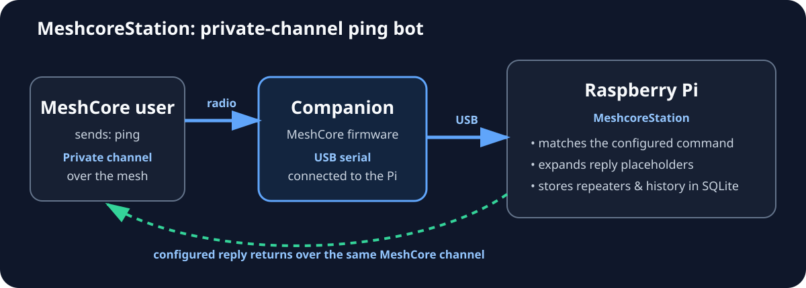
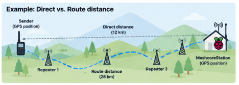
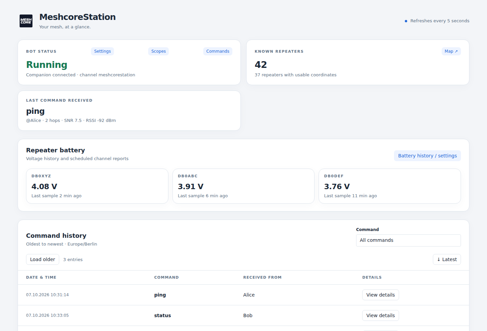
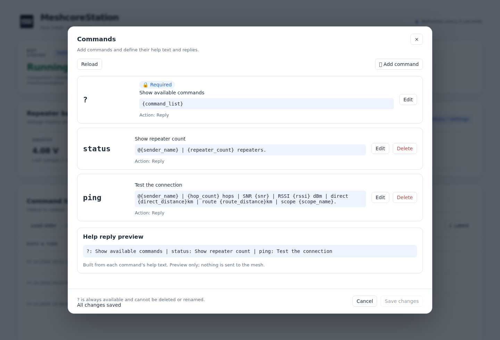

# MeshcoreStation

MeshcoreStation started as a **personal ping bot for MeshCore** and has grown into a small Raspberry Pi station for interacting with a MeshCore network.

The bot listens on a **private MeshCore channel**. A MeshCore **Companion** device must be connected to the Raspberry Pi over **USB serial**. MeshcoreStation uses that Companion connection to receive channel messages, detect configured commands, build replies, and send those replies back over the mesh.

Commands are not hard-coded. Their trigger, help text, action, and reply template are stored in SQLite and can be changed from the web interface.



Current application version: **2.0.0**.

## What it does

MeshcoreStation combines a private-channel command bot with a small web dashboard.

A typical flow is:

1. A MeshCore user sends a command such as `ping` in the private bot channel.
2. The Companion connected to the Raspberry Pi receives the packet.
3. MeshcoreStation matches the command against the configured command list.
4. It collects the values required by the configured reply, such as hop count, SNR, RSSI, distances, repeater count, or scope.
5. The reply is sent back to the same MeshCore channel.
6. The command and packet information are stored for later inspection in the dashboard.

The same process also keeps track of repeaters seen by the Companion, packet routes, saved Companion positions, battery information, scopes, and command history.

## Hardware and channel setup

MeshcoreStation is intended to run on a Raspberry Pi with a MeshCore Companion connected by USB.

The important parts are:

- a Raspberry Pi running Raspberry Pi OS / Debian;
- a MeshCore Companion device running compatible firmware;
- a USB connection between the Companion and the Pi;
- a private MeshCore channel used by the bot;
- the same channel configured on the Companion and selected in MeshcoreStation.

After installation, open the MeshcoreStation web interface, select the Companion serial port in **Settings**, and select the private bot channel in **Channels**.

The Companion is the actual radio interface. MeshcoreStation does not talk to the LoRa radio directly.

## Configurable commands and replies

Commands are stored in the SQLite database and can be added, removed, or edited from the web interface.

Each command has:

- a **trigger**, such as `ping`;
- a short **help text**;
- an **action**;
- a configurable **reply template**.

Available actions currently include:

- **Reply** — build and send a reply only;
- **Get sender position** — request/store the sender position and then reply;
- **Add scope** — create a reply scope and then reply.

Reply templates can contain placeholders such as:

```text
{sender_name}
{hop_count}
{snr}
{rssi}
{direct_distance}
{route_distance}
{repeater_count}
{scope_name}
```

If a value cannot be determined, the template renderer uses `unknown` rather than inventing a value.

## Default commands

A fresh database starts with three commands.

### `?` — help

Shows the currently configured command list.

Default reply:

```text
{command_list}
```

Because the help text is generated from the database, it automatically reflects commands that you add, remove, or rename.

### `status` — repeater count

Returns the sender name and the number of repeaters currently known to MeshcoreStation.

Default reply:

```text
@{sender_name} | {repeater_count} repeaters.
```

Example:

```text
@Alice | 42 repeaters.
```

The repeater count comes from MeshcoreStation's SQLite database.

### `ping` — connection and route test

The default ping command reports the received route information and signal values for that packet.

Default reply:

```text
@{sender_name} | {hop_count} hops | SNR {snr} | RSSI {rssi} dBm | direct {direct_distance}km | route {route_distance}km | scope {scope_name}.
```

Example:

```text
@Alice | 2 hops | SNR 7.5 | RSSI -92 dBm | direct 12.34km | route 18.76km | scope home.
```

The individual values mean:

- **hop count** — number of repeater hops recorded for the received packet;
- **SNR** — signal-to-noise ratio reported for the matching receive packet;
- **RSSI** — received signal strength in dBm;
- **direct distance** — straight-line geographic distance between the saved sender position and the bot Companion;
- **route distance** — geographic distance following the resolved repeater route;
- **scope** — reply scope matched to the received packet.

## Repeaters and the map

MeshcoreStation stores every repeater advertisement it sees in SQLite.

For each repeater it keeps information such as:

- public key;
- name;
- latitude and longitude;
- first and last time seen;
- advertisement count;
- advertised path information.

Repeaters are updated when they are seen again rather than being duplicated.

The dashboard shows the total number of known repeaters and provides a **Map** view. Repeaters with usable coordinates are displayed on an OpenStreetMap background together with the saved bot position.

### Repeater configuration

MeshcoreStation can also be used to manage a reachable MeshCore repeater from the web interface. After selecting a repeater and connecting with the appropriate repeater password, you can inspect status, telemetry, neighbours, and access permissions.

With administrator access, supported repeater settings can be read and changed remotely, including the repeater name, radio parameters, TX power, location, advertisement intervals, packet forwarding, flood settings, owner information, and advanced radio/routing options. MeshcoreStation can also manage regions and permissions and perform actions such as sending an advertisement, synchronizing the repeater clock, or rebooting the repeater.

Configuration changes are validated by MeshcoreStation and, where possible, read back from the repeater after saving so the applied value can be reviewed.

## Direct distance and route distance

For every recorded command, the details popup shows a route map with direct distance, route distance, and the ordered sender → repeaters → bot sequence above it. Repeater names are shown when uniquely known; unknown or ambiguous hops keep their key prefixes. Distances use the saved sender snapshot and latest saved repeater/bot positions. Missing endpoint positions show “Not available”; incomplete routes show a lower bound (≥).

The packet route is shown as:

```text
sender -> repeater 1 -> repeater 2 -> ... -> bot
```



Unknown, ambiguous, or unlocated repeater hops are not guessed. They are shown as unresolved and break the drawn route line.


The two distance values intentionally describe different things.

### Direct distance

`direct_distance` is the straight-line great-circle distance between:

- the saved position of the sender Companion; and
- the advertised position of the MeshcoreStation Companion.

It does **not** follow roads, terrain, or repeater hops.

If the sender position or bot position is not available, the value cannot be calculated.

### Route distance

`route_distance` uses the repeater path recorded for the received packet.

When the repeater identities and coordinates can all be resolved, MeshcoreStation calculates:

```text
sender -> repeater 1 -> repeater 2 -> ... -> bot
```

and adds the geographic distance of each segment.

For a direct packet with zero repeater hops, route distance and direct distance are the same.

The route value can include a qualifier:

- `18.76` — the complete route was resolved;
- `~18.76` — one or more short path hashes were ambiguous, but MeshcoreStation could select a geographically plausible route;
- `>=18.76` — one or more hops could not be resolved, so the shown value is only a lower bound;
- `unknown` — the route could not be calculated reliably.

The route is a geographic approximation between recorded node coordinates. It is **not** the actual RF propagation path and does not account for terrain, antenna patterns, reflections, or other radio effects.

## Web dashboard

The dashboard provides a browser-based view of the station, including:

- bot/Companion connection status;
- known repeater count;
- last received command;
- command history and packet details;
- repeater map;
- route maps for ping commands;
- Companion, channel, command, and scope configuration;
- repeater management;
- battery monitoring and history.

The screenshots below are rendered from MeshcoreStation's actual web UI and CSS with representative sample values, so they can be generated without a live radio session.

### Dashboard overview



### Configurable commands



## Raspberry Pi installation

MeshcoreStation targets Raspberry Pi OS / Debian with systemd and Python 3.12 or newer.

Clone the public repository and run the installer as your normal user:

```bash
git clone https://github.com/zebbel/MeshcoreStation.git
cd MeshcoreStation
bash install.sh
```

Choose **Install / repair** and select the web port. Port 80 is the default.

The installer:

- installs required Debian build/runtime packages and Git;
- creates `.venv/` and installs `requirements.txt`;
- creates `meshcorestation.env`;
- installs and enables `meshcorestation.service`;
- installs the `meshcorestation` control command in `/usr/local/bin`;
- adds the service user to `dialout` for USB serial access;
- starts the application.

After installation, open the Pi's address in a browser, then use **Settings** to select the Companion serial port and **Channels** to select the bot channel.

## Updates from the web app

In **Settings → Updates**, select **Check for updates**. The panel shows the installed version and commit, the latest checked version and commit on GitHub `main`, and a **View changes on GitHub** link. Select **Install update** and confirm to install that exact checked commit. Checks and installations only happen when requested.

**One-time setup for existing installations:** run `meshcorestation update` in the Pi terminal to obtain this version and install the background update service. Then hard-refresh the dashboard. New installations enable web updates automatically.

Web installation requires a clean Git checkout of `main` from `https://github.com/zebbel/MeshcoreStation.git` and a fast-forward update. It refuses local source edits and checks free disk space first. A separate systemd service stops the app, backs up the source, data directory (including the stopped SQLite database), environment settings and Python environment, installs dependencies, runs the installation check, and restarts the app. If installation or the dashboard health check fails, it restores the previous installation. Radio connectivity is not part of the health check: an unplugged companion does not make an otherwise successful update fail.

The panel waits for the dashboard to reconnect and offers **Reload dashboard** when finished. Updates may take several minutes on a Pi Zero. Backups are retained in `.updates/backup-<timestamp>/` and are never automatically deleted. Review and remove old backups when no longer needed to reclaim space. They contain private settings and history; keep them private. An interrupted transaction is recovered by the update service after reboot; failures that need manual attention show the backup location in the panel. Worker logs are available with `journalctl -u meshcorestation-update.service`.

The update worker runs as the installation owner. Setup grants that account passwordless permission only for starting and stopping `meshcorestation.service`. Web updates use the dashboard's existing local-network and same-origin controls; keep dashboard access limited to trusted users. Unit-file or operating-system changes in a future release may still require terminal setup.

## Manual GitHub updates

The terminal updater remains available alongside the web controls. MeshcoreStation does not poll GitHub or automatically install new versions.

Run:

```bash
meshcorestation update
```

or choose **Update from GitHub** in:

```bash
bash install.sh
```

The updater uses the configured upstream Git remote. It requires:

- an installation made from a Git clone;
- a checked-out branch with an upstream tracking branch;
- a clean Git working tree;
- a fast-forward update.

The update process fetches the upstream branch, stops the service if it was running, fast-forwards the source, installs changed Python requirements, runs the installation smoke check, refreshes the systemd unit and control command, and starts the service again if it was running before the update.

Local source changes intentionally block `meshcorestation update`.

## Service commands

```bash
meshcorestation start
meshcorestation stop
meshcorestation restart
meshcorestation status
meshcorestation recent
meshcorestation logs
meshcorestation update
```

## Configuration and data

The installer creates `meshcorestation.env` with these settings:

| Variable | Purpose | Default |
| --- | --- | --- |
| `MESHCORESTATION_DATA_DIR` | Database, lock, and logs directory | `<project>/data` |
| `MESHCORESTATION_HOST` | Web listen address | `0.0.0.0` |
| `MESHCORESTATION_PORT` | Web port | `80` |
| `MESHCORESTATION_TIMEZONE` | Dashboard timezone | `Europe/Berlin` |

Persistent application data is stored under `data/`.

The main SQLite database is:

```text
data/meshcorestation.db
```

It contains bot settings, repeaters, positions, scopes, configurable commands, command/message history, battery samples, and report state.

Rotating application logs are stored under:

```text
data/logs/
```

The following paths are ignored by Git and are not overwritten by normal source updates:

```text
.venv/
data/
meshcorestation.env
meshcorestation.env.backup-*
requirements-installed.txt
```

## Source layout

| Path | Responsibility |
| --- | --- |
| `meshcorestation/__main__.py` | Process lifecycle and single-instance lock |
| `meshcorestation/config.py` | Paths and web configuration |
| `meshcorestation/runtime.py` | Radio session and reconnect lifecycle |
| `meshcorestation/bridge.py` | Web-to-radio event-loop bridge |
| `meshcorestation/radio/` | Companion, bot, contacts, channels, repeater control, telemetry |
| `meshcorestation/commands/` | Command templates, placeholders, and actions |
| `meshcorestation/storage/` | SQLite schema and persistence |
| `meshcorestation/web/` | Dashboard and HTTP APIs |
| `meshcorestation/web/assets/` | Browser JavaScript, CSS, maps, and local assets |
| `docs/images/` | README diagrams |
| `install.sh` | Install/repair/update/uninstall menu |
| `scripts/meshcorestation` | Installed service/update command |
| `scripts/check_install.py` | Offline installation smoke check |
| `tests/` | Python and browser-DOM regression tests |

## Uninstall

Run:

```bash
bash install.sh --uninstall
```

The uninstall action removes the systemd service, `/usr/local/bin/meshcorestation`, and `.venv/`. By default it leaves the source, SQLite database, logs, and environment configuration in place.
